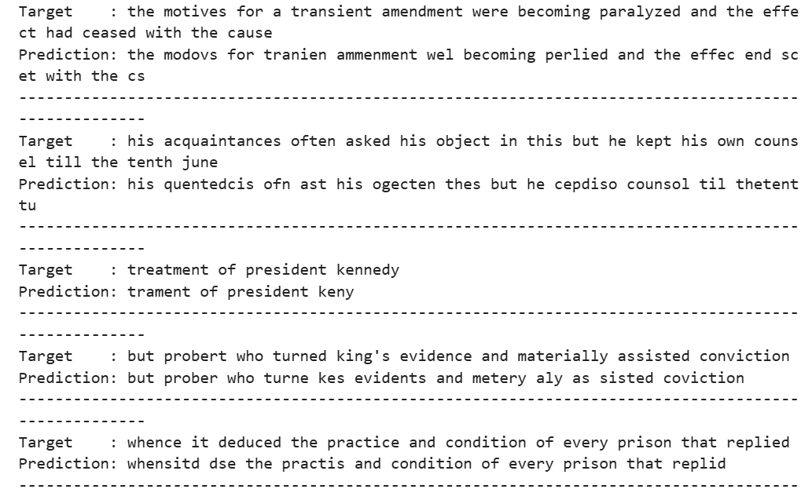

# Speech-to-Text (STT) using LJSpeech Dataset

## 📌 Overview

This project implements a **Speech-to-Text (STT)** system using the **[LJSpeech Dataset](https://www.kaggle.com/datasets/dromosys/ljspeech)**. The model is trained to convert spoken English audio into text with high accuracy.
The project explores preprocessing, feature extraction, model training, and evaluation for automatic speech recognition (ASR).

---

## 📂 Dataset

* **Dataset:** [LJSpeech](https://www.kaggle.com/datasets/dromosys/ljspeech)
* **Description:** The LJSpeech dataset contains **13,100 audio clips** of a single female speaker reading passages from 7 non-fiction books.
* **Content:**

  * Audio files (`.wav`)
  * Transcriptions (`.txt`)

This dataset is widely used for training **TTS (Text-to-Speech)** and **STT (Speech-to-Text)** models.

---

## ⚙️ Project Workflow

1. **Data Preprocessing**

   * Audio normalization
   * Conversion to Mel-spectrograms / MFCC features

2. **Model Training**

   * RNN 
   * Connectionist Temporal Classification (CTC) loss

3. **Evaluation**

   * Word Error Rate (WER)
   * Character Error Rate (CER)

4. **Results Visualization**

   * Training & validation curves
   * Predicted vs Ground truth comparisons

---

## 📊 Results

Below is a screenshot of the model’s evaluation results:

  

---

## 🚀 Installation & Usage

### Requirements

* Python 3.8+
* PyTorch / TensorFlow
* Librosa
* NumPy, Pandas
* Matplotlib / Seaborn

---

## 📈 Future Improvements

* Experiment with **Transformer-based models (e.g., Wav2Vec2.0, Whisper)**
* Use **multi-speaker datasets** for robustness
* Integrate **real-time inference pipeline**

---

## 🙌 Acknowledgements

* [LJSpeech Dataset](https://www.kaggle.com/datasets/dromosys/ljspeech)
* Open-source ASR toolkits and frameworks

